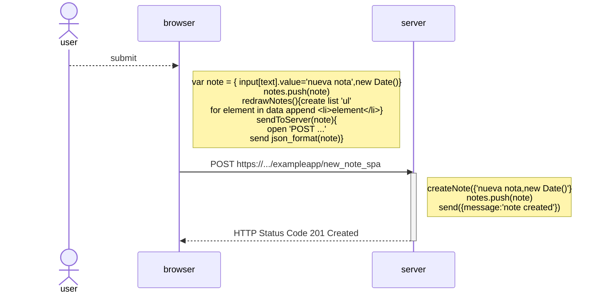

# Exercice 0.6 
## New note on single-page application diagram
### Author: Enrique Anton Lopez
### Date: 2024/06/13

```mermaid   
    sequenceDiagram
    actor user
    participant browser
    participant server


    user-->>browser:submit
    Note right of browser: var note = { input[text].value='nueva nota',new Date()}<br>     notes.push(note)<br>redrawNotes(){create list 'ul'<br>for element in data append <li>element</li>}<br>    sendToServer(note){<br>open 'POST ...'<br>send json_format(note)}
    browser->>server: POST https://.../exampleapp/new_note_spa
    activate server
    
    Note right of server: createNote({'nueva nota,new Date()'}<br>notes.push(note)<br>send({message:'note created'})
    server-->>browser: HTTP  Status Code 201 Created
    deactivate server

   

```