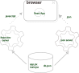

# Parte 2 Comunicándose con el servidor

## a Colecciones dinamicas. Modulos

### Fragmentos de codigo en Visual Studio

- [`snippets`](https://code.visualstudio.com/docs/editor/userdefinedsnippets): trozos de codigo reutilizavbbles   
- hay para diferente slenguajes
- se generarna a partir de 
- se pueden instalr desde [Marketplace](https://marketplace.visualstudio.com/vscode)
- 
### Programacion funcional con arrays
- [Arrays](https://developer.mozilla.org/es/docs/Web/JavaScript/Reference/Global_Objects/Array)
- funciones:
  - [find](https://developer.mozilla.org/es/docs/Web/JavaScript/Reference/Global_Objects/Array/find). busca un elemento que cumpla una condicion dada en una funcioon callback
    - `elem = arr.find(callbackFn)`
    -  `elem = arr.find(callbackFn, thisArg)`
  - [filter](https://developer.mozilla.org/en-US/docs/Web/JavaScript/Reference/Global_Objects/Array/filter). crea una copia sueprficial de una parte de un array cumpiendo las condiciones dadas por callback
    - `arrFilter = arr.filter(callbackFn)` `...thisArg)`
  - [map](https://developer.mozilla.org/en-US/docs/Web/JavaScript/Reference/Global_Objects/Array/map) Crea un nuevo array tansformando cada aelemento a partir del array existente
      - `newArr = arr.map(callbackFn)` `...thisArg)`
  - [reduce](https://developer.mozilla.org/es/docs/Web/JavaScript/Reference/Global_Objects/Array/reduce)
    - `sumWithInitial = array1.reduce((accumulator, currentValue) => accumulator + currentValue,  initialValue,)` 
- [Programación funcional en JavaScript](https://www.youtube.com/playlist?list=PL0zVEGEvSaeEd9hlmCXrk5yUyqUag-n84)
### Renderizar colecciones (arrays de objetos indexados)
- La funcion `map`de Javascript nos permite renderizar colecciones y arrays de forma sencilla modicficando cada elemento y dandole el formato que queramos
- Si tenemos esta aplicacion:   
`Main.jsx`
```jsx
    import React from 'react'
    import ReactDOM from 'react-dom/client'

    import App from './App'

    const notes = [
    {
        id: 1,
        content: 'HTML is easy',
        important: true
    },
    {
        id: 2,
        content: 'Browser can execute only JavaScript',
        important: false
    },
    {
        id: 3,
        content: 'GET and POST are the most important methods of HTTP protocol',
        important: true
    }
    ]

    ReactDOM.createRoot(document.getElementById('root')).render(
    <App notes={notes} />
    )
```
`App.jsx`
```jsx
    const App = (props) => {
    const { notes } = props

    return (
        <div>
        <h1>Notes</h1>
        <ul>
            <li>{notes[0].content}</li>
            <li>{notes[1].content}</li>
            <li>{notes[2].content}</li>
        </ul>
        </div>
    )
    }
    export default App
```
- Se puede mostrar dinammicacmente la lista de notas mediante `map`
  - `notes.map(note => <li>{note.content}</li>)`, que mostrara en el navegador: 
```html
    <li>HTML is easy</li>,
    <li>Browser can execute only JavaScript</li>,
    <li>GET and POST are the most important methods of HTTP protocol</li>,
```
- La funcion `map`es en javascript por lo que habra que ponerla entre llaves y la etiqueta `<ul>`que engloba una lista:
- `<ul>{notes.map(note => <li>{note.content}</li>)}</ul>`
- Por cada elemento `note` se crea un elemento de lista con el atributo `note.content`
#### Es necesario (y muy recomendable) incluir un atributo `key`para las colecciones
- Tenemos un warning que se nos muestra por consola:
```bash
Warning: Each child in a list should have a unique "key" prop.

Check the render method of `App`. See https://reactjs.org/link/warning-keys for more information.
    at li
    at App (http://localhost:5173/src/App.jsx?t=1720012547714:18:11)
```
- Se necesita incluir una clave unica para cada elemento, la coleccion notes y continene una propiedad id que nos viene muy bien
```jsx
      <ul>
        {notes.map(note => 
          <li key={note.id}>
            {note.content}
          </li>
        )}
      </ul>
```
- Este atributo nos permite identiicar no solo elementos de colecciones. Tambien diferenciar componentes o formularios
- MAs info sobre [`key`  en REact](https://es.react.dev/learn/preserving-and-resetting-state#option-2-resetting-state-with-a-key)
  
#### &#128122; <span style="color:red">   Antipatron </span> Indice del array como key

- `notes.map((note, i) => ...)`, i recoge el indice del array y se podria colocar een el atributo `key` pero podria generar resultados imprevisibles. Mejor generar un id especifico
- Leer : [esto](https://robinpokorny.com/blog/index-as-a-key-is-an-anti-pattern/)
### Refactorizar modulos
- Creamos un modulo para las notas
- Ponemos los atributos especiificosde las props entre llaves para accdere a ellos
- Ahora la ksy se añade a cada elemento `Note` y no al elemento `li`
- Mejor si popnemos el comopnete Note en un archivo aparte , lo pondremos en una carpeta `src/components`
```jsx
const Note = ({ note }) => {
  return (
    <li>{note.content}</li>
  )
}
export default Note
....
import Note from "./components/Note";

const App = ({ notes }) => {
  return (
    <div>
      <h1>Notes</h1>
      <ul>

        {notes.map(note => 
          <Note key={note.id} note={note} />
        )}
      </ul>
    </div>
  )
}
```
## b Formularios
### Guardar notas en  el estado del componente
- En la aplicacione de notas, si queremos añadir nuevas notas las podemos almacenar eln el estado
- Inicializamos el array notes con el array que se encuentra en Main.jsx
- TAmbien se podria empezar con una lista vacia `useState([])` y omitir el paramtro `props`
- 
```jsx
import { useState } from 'react'
import Note from './components/Note'

const App = (props) => {
  const [notes, setNotes] = useState(props.notes)

  return (
    <div>
      <h1>Notes</h1>
      <ul>
        {notes.map(note => 
          <Note key={note.id} note={note} />
        )}
      </ul>
    </div>
  )
}
export default App 
```
- Añadimos un formulario con un input para añadir nuevas notas
- Tambien una funcion asociada la formaulario
```jsx
const App = (props) => {
  const [notes, setNotes] = useState(props.notes)

  const addNote = (event) => {
    event.preventDefault()
    console.log('button clicked', event.target)
  }
  return (
    <div>
      <h1>Notes</h1>
      <ul>
        {notes.map(note => 
          <Note key={note.id} note={note} />
        )}
      </ul>
      <form onSubmit={addNote}>
        <input />
        <button type="submit">save</button>
      </form>   
    </div>
  )
}
```
- Por ahora la funcion `addNote`  solo muestra el lemento por consola `console.log('button clicked', event.target)`  que recibe el evento `event`que entra por parametro
### [Componentes controlados](https://es.react.dev/reference/react-dom/components/input#controlling-an-input-with-a-state-variable) 
- React necesita tener el valor en todo momento del input debido a los dirferentes renderizados que se pueden hacer 
- La forma d hacerlo es crear un estado para el input , en este caso  un string `newNote`
```jsx
    ...
    const [notes, setNotes] = useState(props.notes)
    const [newNote, setNewNote] = useState(
      'a new note...'
    )
    ... 
```
- Y tenemos que añadirlo como prop en el atributo value del input
```jsx
     <form onSubmit={addNote}>
        <input value={newNote} />
        <button type="submit">save</button>
      </form>   
```
- Pero tambien tenemos que añadirle un manejador que actualize el estado newNote cada vez que cambie el contenido del input
```jsx
    ...
    const handleNoteChange = (event) => {
      console.log(event.target.value)
      setNewNote(event.target.value)
    }
    ...
    (...
    <input
      value={newNote}
      onChange={handleNoteChange}
    />
    ...)
```
- Para que se termine qde guardar la nota debemos completar la funcion addNote
- Se crea un objeto con el campo e texto del input, un campo importatnt aleatorio por ahora y un id incrementado
- El objeto se concatena al array notes mediante la funcion de estado `setNotes` 
- `concat` crea un nueva copia del array con el elemento nuevo   BIEN , yaque el estado no dsedebe mutrtrar directamente
- Pone a "" el input con `setNewNote`
```jsx
const addNote = (event) => {
  event.preventDefault()
  const noteObject = {
    content: newNote,
    important: Math.random() < 0.5,
    id: notes.length + 1,
  }

  setNotes(notes.concat(noteObject))
  setNewNote('')
}
```
### Filtrar loque se quiere mostrar
- Qeremos filtrar segun el atributo importatnt que es booleano. Añadimos un estado booleano
```jsx
const [showAll, setShowAll] = useState(true)
```
- Y cambiamos el array que se mostrara en el map segun si el estado `showAll` es true o false
- Esto es un condicional: en `notesToShow` se guardara dependiendo de la condicion `showAll`. Si es true sera igual a notes, si es false ser hara un filtrado por las notas importantes (metodo filter de Array) 
- El operador `===`se asegura de que la compracion se haga de forma [estricta](https://developer.mozilla.org/es/docs/Web/JavaScript/Equality_comparisons_and_sameness)
```jsx
  const notesToShow = showAll
    ? notes
    : notes.filter(note => note.important === true)
```
- TEnemos que ñadir un boton que permita cambiar el estado `showAll` al usuario
- Ya contien un manejador dentro del evento OnClick. Es una funcion simple que cambia de `showAll` de true a false y viceversa
- Dentro del boton se mostrar el texto important si la condicion `showAll` es true o all si es false
```jsx
  return (
    <div>
      <h1>Notes</h1>
      <div>
        <button onClick={() => setShowAll(!showAll)}>
          show {showAll ? 'important' : 'all' }
        </button>
      </div>
      ...
```
## c Obteniedo datos del servidor
- Instalaremos [JSON Server](https://github.com/typicode/json-server) para entender comop se comunica el frontend con el backend
- creamos un archivo `db.json`een la raiz del proyecto:
```json
{
  "notes": [
    {
      "id": 1,
      "content": "HTML is easy",
      "important": true
    },
    {
      "id": 2,
      "content": "Browser can execute only JavaScript",
      "important": false
    },
    {
      "id": 3,
      "content": "GET and POST are the most important methods of HTTP protocol",
      "important": true
    }
  ]
}
```
- Instalacion global
  - `npm install -g json-server`
- Ejecutar `json-server`
  - `json-server --port 3001 --watch ./directorio/db.json`
- Si hacemos la instalacion local, sin `-g`, para ejecutar el servidor
  - `npx json-server --port 3001 --watch db.json`
- Si vamos a `http://localhost:3001/notes`,en el navegador, nos mostrara el achivo `db.json`en formato `json`
- Segun que navegador , no lo muestra bonito, por si acaso se ppuede instalar:
  - [JSONVue](https://chrome.google.com/webstore/detail/jsonview/chklaanhfefbnpoihckbnefhakgolnmc)
- Este servidor nos permitira guardar os datos en el archivo json de la mima manera que una base de datos en un servidor
### Obtenidendo datos desde el frontend
- La manera antigua de obtener datso del servidor era mediante [XMLHttpRequest](https://developer.mozilla.org/es/docs/Web/API/XMLHttpRequest), solicitud HTTP mediante objeto XHR
- Se usa desde 1999,a unque ya no se recomienda
- Ahora se usa el metodo [fetch](https://developer.mozilla.org/es/docs/Web/API/fetch), basdo en [promesas](https://developer.mozilla.org/es/docs/Web/JavaScript/Reference/Global_Objects/Promise)
```js
const xhttp = new XMLHttpRequest()
xhttp.onreadystatechange = function() {
  if (this.readyState == 4 && this.status == 200) {
    const data = JSON.parse(this.responseText)
    // handle the response that is saved in variable data
  }
}
xhttp.open('GET', '/data.json', true)
xhttp.send()
```
- Con XHR 
1. Se registraba un controlador de eventos `onreadystatechange` 
2. La solicitud se envia al servidor `open`, `send`
3. el controlador se ejecuta de forma `asincrona`, esto ses cuando haya un cambio 

- En Java se puede hacer esto pero de forma sincrona. Priemro eera a quque llegue el resultado de la solicitud HTTP para despues almacenarlas en una variable y procesarlas
- Los motores Javasccript funcionan de forma [asincrona](https://developer.mozilla.org/es/docs/Web/JavaScript/Event_loop)
  - Casi todas las [operaciones  IO](https://es.wikipedia.org/wiki/Perif%C3%A9rico_de_entrada/salida) son no bloquieantes. El codigo continua au cuando no hayan concoluido los resultados de las demas operaciones
  - Cuando finazlia una operaion asincrona, el motor javascript llma a los controladores de eventso registrados en la operacion
  - Los motores javascript manejan un solo hilo ( no ejecutan codigo en paralelo), por tanto es necesario el modo sin bloqueo, ya que le navegador se quedaria `pillado`, `congelado` <span  >&#10052;</span>
  - Si alguna ioperacion require mucho tiempo por si mima  &#128164; (bucles que se alargan) , el navegador se atascara
    - Ningun calculo individual deberia llevar mucho tiempo &#128128;
  - Los [web workers](https://developer.mozilla.org/es/docs/Web/API/Web_Workers_API/Using_web_workers) permiten la ejecucion de codigo paralelo, pero una ventana individual es manadjada por un solo hilo
> Ver:
> [¿Qué diablos es el ciclo del evento de todos modos?](https://www.youtube.com/watch?v=8aGhZQkoFbQ)

### Obtener datos del servidor mediante fetch o axios
- Se puede usar [`fetch`](https://developer.mozilla.org/es/docs/Web/API/fetch). Es estandar y compatible con todos los naveegadores
- Usaremos [`axios`](https://github.com/axios/axios). Se innstala medinate npm
- [`npm`](https://docs.npmjs.com/about-npm) es el gestor de paquetes de Node.js
- Los proyectos que usan `npm`tienen un archivo `package.json`en su raiz donde se configuran varias cosas de la instalacion de estos paquetes
- La libreria axios se podria definir eln el apartado dependencies de package.json pero tsambien se puede instalar desde consola: `npm install axios`. De esta  forma axios se incluira en `package.json`, `dependencies`. El codigo quedara instalado en la caprepeta `node_modules`
### Configuracion JSON Server
- Instalamos JSON Server para usarlo solo durante desarrollo
- `npm install json-server --save-dev`
- y añadimos en el apartado `scripts`de `package.json`
```json
{
  // ... 
  "scripts": {
    "dev": "vite",
    "build": "vite build",
    "lint": "eslint . --ext js,jsx --report-unused-disable-directives --max-warnings 0",
    "preview": "vite preview",
    "server": "json-server --port 3001 --watch ./src/db.json"
  },
}
```
- De esta manera se  puede iniciar json-server mediante el comando `npm run server`
### Axios y promesas
- Ya tenemos el servidor json en marcha. Lo debemos haber ejecutado desde un terminal nuevo para no tener que parar el servidor de React
- Si agreagamos esto en `main.jsx`
```jsx
import axios from 'axios'

const promise = axios.get('http://localhost:3001/notes')
console.log(promise)

const promise2 = axios.get('http://localhost:3001/foobar')
console.log(promise2)
```
- LA consola de localhost:5173 nos devuelve una [promesa](https://developer.mozilla.org/en-US/docs/Web/JavaScript/Guide/Using_promises)
  - Objetoi que representa la eventual finazlizacion o falla de una operacion asincrona
  - Puede tener 3 estados distintos:
    - pendiente (pending): valor final o uno de los dos siguientes no esta disponible aun
    - cumplida (fullfilled): operacion completada, el valor finalesta dispopnible
    - rechazada (rejected): un error impidio obtener el valor final
  - En el ejemplo, la prioomesa que llama a 'http://localhost:3001/notes' estra cumplida, este enlace existe y corresponde a db.json
  - LA segunda esta rechazada ya que la direccion es inexistente
  - Para acceder eal resultado de la promesa lo jhacemos mediante el metdo `then`
    - `promise.then(response => {  console.log(response)})`
    - Esto imprime la respuesta por consola. Esta respuesta es un objeto `response` que continene: los datos devueltos, el `status code`y encabezados `headers`
```jsx
        axios
        .get("http://localhost:3001/notes")
        .then((response) => {
          const notes = response.data;
          console.log(notes);
        });
```
- Des ta manera obtenemos dsolo los datos que nos interesan . Es mas legible colocar cada llamada en uan linea dirferente
- Podriamos passr los datos  al componente App, pero es osseria un problema  porque hay queesperar la respuiesta para poder renderizarlo del todo. En vez de eso pondremoss la bvusqueda de datos en el componete App
### Effect-hooks, sincroizcion con sistemas externos
- Para ello usaremos el hook `useEffect`. Permite conectar y sinrnizar con sistemas externos como: red, DOM del navegador, animaciones, codigo difretne de REact,...
- Ahora podeos simplificar `main.jsx`
```jsx
import ReactDOM from "react-dom/client";
import App from "./App";
ReactDOM.createRoot(document.getElementById("root")).render(<App />);
```
- Y en `App.jsx`
```jsx
import { useState, useEffect } from 'react'
import axios from 'axios'
import Note from './components/Note'


const App = () => {
  const [notes, setNotes] = useState([])
  const [newNote, setNewNote] = useState('')
  const [showAll, setShowAll] = useState(true)


  useEffect(() => {
    console.log('effect')
    axios
      .get('http://localhost:3001/notes')
      .then(response => {
        console.log('promise fulfilled')
        setNotes(response.data)
      })
  }, [])
  console.log('render', notes.length, 'notes')

  // ...
}
```
- LA ejecucion imprime por consola:
```
render 0 notes
effect
promise fulfilled
render 3 notes
```
1. el componenete se renderiza, se imprime render 0 notes, ya que aun no tenemos los datos
2. La funcion que esta contenida dentro deuseEfect se ejecuta despues de la renderizacion
3. Se imprime `'effect'` por consola
4. axios.get busca los datos en el servidor `'http://localhost:3001/notes'`
5. registra la funcion:
   ```jsx
   response => { 
    console.log('promise fulfilled')
    setNotes(response.data)}
    ```
     en el controlador de eventos con `then`
6. Cuando llegan los datos se ejecuta esta funcion. Se imprime `'promise fullfilled'` y se ejecuta `setNotes`
7. Esta funcion de actuzaliacion de estado renderiza de nuevo el componetne y tambien los  datos que ya estan en la varaible deestado `notes`
- La funcion useEffect tiene dos parametros: el primero es la funcion que ejerce el efecto y el segundo es la [frecuencia](https://es.react.dev/reference/react/useEffect#parameters) de ejecucion de la funcion, que en est caso es una matriz vacia `[]`. El efecto en este caso solo se ejecuta con el primer renderizado  
### Diagrama de ejecucion 
  
## d Alterando datos en el servidor
### [Rest](https://es.wikipedia.org/wiki/Transferencia_de_Estado_Representacional)
- En Rest se utiulzian recursos que tineen asociadoa ua direccion unica, una URL
- El recurso /notes/3 nos daria una nota unica donde 3 es el id del recurso
- /notes nos  daria todas las notas
- EStos recursos se obtienen del servidor mediante HTTP GET
- HTTP GET /notes/3 nos devuelve las nota con el id 3
- HTTP GET /notes devuelve todas las notas
- Json-server require el envo en formato JSON. LA solicitud debe tener el Content-Type con el valor application/json
### Enviar datos al servidor
- Para enviar datos al servidor se utiliza HTTP POST. Modifcamos addNote para crear  uan nueva nota pero sin el atributo `id`, ya se encarga el servidor de proporcionarlo
  ```jsx
  addNote = event => {
    event.preventDefault()
    const noteObject = {
      content: newNote,
      important: Math.random() < 0.5,
    }

    axios
      .post('http://localhost:3001/notes', noteObject)
      .then(response => {
        console.log(response)
      })
  }
  ```
- En la consola se mostrara el objeto response. Podemos ver que status code es 201 (created) .
- Si nos vamos a Netowrk . En payload se muestran los datos que se han enviado  para guardar
- En la pestaña response se  muestra la respuesta del servidor
PAra que se actuzlice el estado tenemos que añadir :
  ```jsx
    axios
      .post('http://localhost:3001/notes', noteObject)
      .then(response => {
        setNotes(notes.concat(response.data))
        setNewNote('')
      })
  }
  ```
### Cambiar la impòrtancia de las notas
- Añadimos un botn al componente Note para cambioar la importancia de las notas
  ```jsx
  const Note = ({ note, toggleImportance }) => {
    const label = note.important
      ? 'make not important' : 'make important'

    return (
      <li>
        {note.content} 
        <button onClick={toggleImportance}>{label}</button>
      </li>
    )
  }
  ```
- En App.jsx añadimos la funcion toggleImportanceOf que pasaremos a Note
  ```jsx
  const toggleImportanceOf = id => {
    const url = `http://localhost:3001/notes/${id}`
    const note = notes.find(n => n.id === id)
    const changedNote = { ...note, important: !note.important }

    axios.put(url, changedNote).then(response => {
      setNotes(notes.map(note => note.id !== id ? note : response.data))
    })
  }
  ```
- Y la pasaremos como prop al objeto Note
  ```jsx
      <Note
        key={i}
        note={note} 
        toggleImportance={() => toggleImportanceOf(note.id)}
      />
  ```
  - La funcion require cmo parametro el id de la nota (lo obtenemos al resnderizarlo donde se muestran todas las notas)
  - La funion find busca la nota por el id
  - En changedNote cambiamos (spread) el atributo important, si es   true sera false o al contrario. Lo que hace realmetne es crear un nuevo objeto copiando todas las propiedades, luego el atributo importatn se cacmbiara a su crontrario
- Hay que tener en  ceunta que hacemos na copia y no accedemos direntamte a un objeto que esta en el estado, lo que NO &#128121; SE PUEDE HACER 
- El put envia la nue nota al servidor, despues en then actualizara segun a respusta la lista d notas. LA funcion map craea una copia del array notes, cuando enceuntra el objeto cambiado por su id lo sustituye por la respuesta del servidor (`response.data`)   

### Refactorizar la comunicacion con el backend por separado 
- Creamos un archivo `notes.js`en una carpeta nueva `src/services`
  ```js
  import axios from 'axios'
  const baseUrl = 'http://localhost:3001/notes'

  const getAll = () => {
    const request = axios.get(baseUrl)
    return request.then(response => response.data)
  }

  const create = newObject => {
    const request = axios.post(baseUrl, newObject)
    return request.then(response => response.data)
  }

  const update = (id, newObject) => {
    const request = axios.put(`${baseUrl}/${id}`, newObject)
    return request.then(response => response.data)
  }

  export default { 
    getAll: getAll, 
    create: create, 
    update: update 
  }
  ```

- Importamos el modulo en App, `import noteService from './services/notes'`
- PAra usar las funciones del modulo se incvoca direntamte a la variable noteService. Ambiamos las funciones que realizan las llamadas al servidor en App 
```jsx
const App = () => {
  // ...

  useEffect(() => {
    noteService
      .getAll()
      .then(initialNotes => {
        setNotes(initialNotes)
      })
  }, [])

  const toggleImportanceOf = id => {
    const note = notes.find(n => n.id === id)
    const changedNote = { ...note, important: !note.important }

    noteService
      .update(id, changedNote)
      .then(returnedNote => {
        setNotes(notes.map(note => note.id !== id ? note : returnedNote))
      })
  }

  const addNote = (event) => {
    event.preventDefault()
    const noteObject = {
      content: newNote,
      important: Math.random() > 0.5
    }
    noteService
      .create(noteObject)
      .then(returnedNote => {
        setNotes(notes.concat(returnedNote))
        setNewNote('')
      })
  }
  // ...
}...
```  
### Optimizacion
```jsx
  export default { 
    getAll: getAll, 
    create: create, 
    update: update 
  }
```
- Esto se puede cambiar por esto
```jsx
export default { getAll, create, update }
```
- Ya que los nombres de las propiedades y los nombres de las variables son iguales (ES6)
### GEstionar errores con las promesas
- Si tuvieramos la opcion de elimiar lnotas podra darse la situacion de que un usuario quisiera cambiar la importancia de una nota que ya no existiera
- Podemos ismularlo de esata amnaera:
  ```jsx
  const getAll = () => {
    const request = axios.get(baseUrl)
    const nonExisting = {
      id: 10000,
      content: 'This note is not saved to server',
      important: true,
    }
    return request.then(response => response.data.concat(nonExisting))
  }
  ```
- Si intentamos cambiaa rla importancia de esta nota, el servidor nos  da un mensaje de error 404 (Not Found)
- ESto se puede gestionar con uno de los trres estados que devuelve una promesa
- El rechazo se puede gestionar con el metodo `catch`. Se encadena al finalk de la promesa. Lo colocamos en la funcion que cambia la importancia de las notas
  ```jsx
  const toggleImportanceOf = id => {
    const note = notes.find(n => n.id === id)
    const changedNote = { ...note, important: !note.important }

    noteService
      .update(id, changedNote).then(returnedNote => {
        setNotes(notes.map(note => note.id !== id ? note : returnedNote))
      })

      .catch(error => {
        alert(
          `the note '${note.content}' was already deleted from server`
        )
        setNotes(notes.filter(n => n.id !== id))
      })
  }
  ```
- si aparece el error ,cmo en este caso semuestra una alerta: `'the note '${note.content}' was already deleted from server'`
- Desepues se actuazlia el estado elimnado la nota rronea en `setNotes` mediante el metodo filter que busca los elemetnso que no tengan ese `id`
- En veza de alert hay metodos mas elegantes de dar la inforamcion
> [Principio d e responsabilida unica](https://es.wikipedia.org/wiki/Principio_de_responsabilidad_%C3%BAnica)   
> [Promesas en cadena](https://es.javascript.info/promise-chaining)   
> [You don't know JS](https://github.com/getify/You-Dont-Know-JS/tree/1st-ed)   
> [You Don't Know JS: Async & Performance](https://github.com/getify/You-Dont-Know-JS/blob/1st-ed/async%20%26%20performance/ch3.md)   
> [Promesas](https://developer.mozilla.org/es/docs/Web/JavaScript/Guide/Using_promises)
## e Estilos en React
- Desde el archivo index.css
```css
h1 {
    color: green;
    font-style: italic;
}
.note {
    color: grey;
    padding-top: 3px;
    font-size: 15px;
}
```
- `import "./index.css";` en el archivo `main.jsx`
- Si queremos añadir una clase a un elemento tinee que ser con `className="note"`
### Mensajes de error sin usar alert
- Creamosun componenet `Notification`
```jsx
const Notification = ({ message }) => {
  if (message === null) {
    return null
  }

  return (
    <div className="error">
      {message}
    </div>
  )
}
export default Notification;
```
- Añadimos un nuevo estado en `App`
- `const [errorMessage, setErrorMessage] = useState('some error happened...')`
- Inserrtamos la notificactcion en App
```jsx
  return (
    <div>
      <h1>Notes</h1>
      <Notification message={errorMessage} />
      <div>
```
- Agreagmos un estilo en index.css
```css
.error {
  color: red;
  background: lightgrey;
  font-size: 20px;
  border-style: solid;
  border-radius: 5px;
  padding: 10px;
  margin-bottom: 10px;
}
```
- Y configuramos la gestion e errores en las diferenets funciones. Por ejempplo en  `toggleImportanceOf`
```jsx
  const toggleImportanceOf = id => {
    const note = notes.find(n => n.id === id)
    const changedNote = { ...note, important: !note.important }

    noteService
      .update(changedNote).then(returnedNote => {
        setNotes(notes.map(note => note.id !== id ? note : returnedNote))
      })
      .catch(error => {

        setErrorMessage(
          `Note '${note.content}' was already removed from server`
        )
        setTimeout(() => {
          setErrorMessage(null)
        }, 5000)
        setNotes(notes.filter(n => n.id !== id))
      })
  }
``` 
### Estilos en linea
- Para incluir estilo dentro de un componente se pueden incluir dentro de una variable que  se aplicara a cada elemento al que se quiera aplicar
  ```jsx
  const Footer = () => {
    const footerStyle = {
      color: 'green',
      fontStyle: 'italic',
      fontSize: 16
    }
    return (
      <div style={footerStyle}>
        <br />
        <em>Note app, Department of Computer Science, University of Helsinki 2024</em>
      </div>
    )
  }
  const App = () => {
      // ...
    return (
      <div>
        <h1>Notes</h1>
        <Notification message={errorMessage} />
        // ...  
        <Footer />
      </div>
    )
  }
  ``` 
- No permiten el uso de pseudoclases
- No permiten el uso de variables de css
- En REact se intenta intergrar el CSS para cada componente. CAda compponente define su HTML, su CSS y su comportamiento 
### Observaciones
#### Valores iniciales en estado 
- El valor  inicial del estado puede dar problemas si no se define bien
```jsx
const [notes, setNotes] = useState([])
```
- Si en vez de array vacio `[]` lo iniciamos como `null` nos daria un error cuando lo quisieramos renderizar mediante `map` 
- `notesToShow.map(note => ...)`estaria ejecutando esto, lo que nos daria error
- otra opcion seria comprobar que notes existe (no es falsy: null, undefined, ...). Si es asi renderizar con map
#### Segundo parametro de Use effect
- Si es un array vacio `[]`el contenido cno cambia y el efcto se ejcuta despues del primer renderizado. Util para inicalizar el estado desde el servidor
- En otras ocaciones neceesitamos el efecto de otra manera: por ejmplo si el componente cambia de una manera particular
- Tenemos esta aplicacion que consulta esta [API de tasas de cambio](https://www.exchangerate-api.com/)
```jsx
import { useState, useEffect } from 'react'
import axios from 'axios'

const App = () => {
  const [value, setValue] = useState('')
  const [rates, setRates] = useState({})
  const [currency, setCurrency] = useState(null)

  useEffect(() => {
    console.log('effect run, currency is now', currency)

    // omitir si la moneda no está definida
    if (currency) {
      console.log('fetching exchange rates...')
      axios
        .get(`https://open.er-api.com/v6/latest/${currency}`)
        .then(response => {
          setRates(response.data.rates)
        })
    }
  }, [currency])

  const handleChange = (event) => {
    setValue(event.target.value)
  }

  const onSearch = (event) => {
    event.preventDefault()
    setCurrency(value)
  }

  return (
    <div>
      <form onSubmit={onSearch}>
        currency: <input value={value} onChange={handleChange} />
        <button type="submit">exchange rate</button>
      </form>
      <pre>
        {JSON.stringify(rates, null, 2)}
      </pre>
    </div>
  )
}

export default App
```
- El segundo parametro de useEffect es `[currency]`. Ahora la función se ejecuta tras el primer renderizado y cuando `currency` cambia
