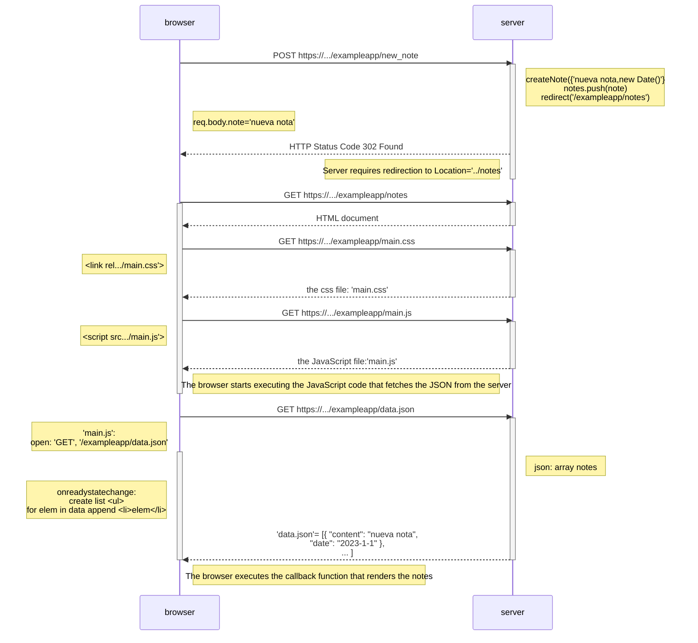

 
# Exercice 0.4
## New note diagram
### Author: Enrique Anton Lopez
### Date: 2024/06/13

```mermaid
sequenceDiagram
    participant browser
    participant server

    browser->>server: POST https://.../exampleapp/new_note

    activate server
    Note right of server: createNote({'nueva nota,new Date()'}<br>notes.push(note)<br>redirect('/exampleapp/notes')
    Note right of browser: req.body.note='nueva nota'  

    server-->>browser: HTTP Status Code 302 Found 
    Note left of server:Server requires redirection to Location='../notes'
    deactivate server

    browser->>server: GET https://.../exampleapp/notes
    activate server
    activate browser
    server-->>browser: HTML document
    deactivate server
    browser->>server: GET https://.../exampleapp/main.css
    activate server
    Note left of browser: <link rel.../main.css'>
    
    server-->>browser: the css file: 'main.css'
    deactivate server

    browser->>server: GET https://.../exampleapp/main.js
    activate server
    Note left of browser: <script src.../main.js'>
    server-->>browser: the JavaScript file:'main.js'
    deactivate server

    Note right of browser: The browser starts executing the JavaScript code that fetches the JSON from the server
    deactivate browser

    browser->>server: GET https://.../exampleapp/data.json
    activate server
    Note left of browser:'main.js':<br> open: 'GET', '/exampleapp/data.json'
    activate browser
    Note right of server: json: array notes
     Note left of browser:onreadystatechange:<br>create list <ul><br>for elem in data append <li>elem</li>
    server-->>browser: 'data.json'= [{ "content": "nueva nota", <br>"date": "2023-1-1" },<br> ... ]
    deactivate browser
    deactivate server

    Note right of browser: The browser executes the callback function that renders the notes
```
