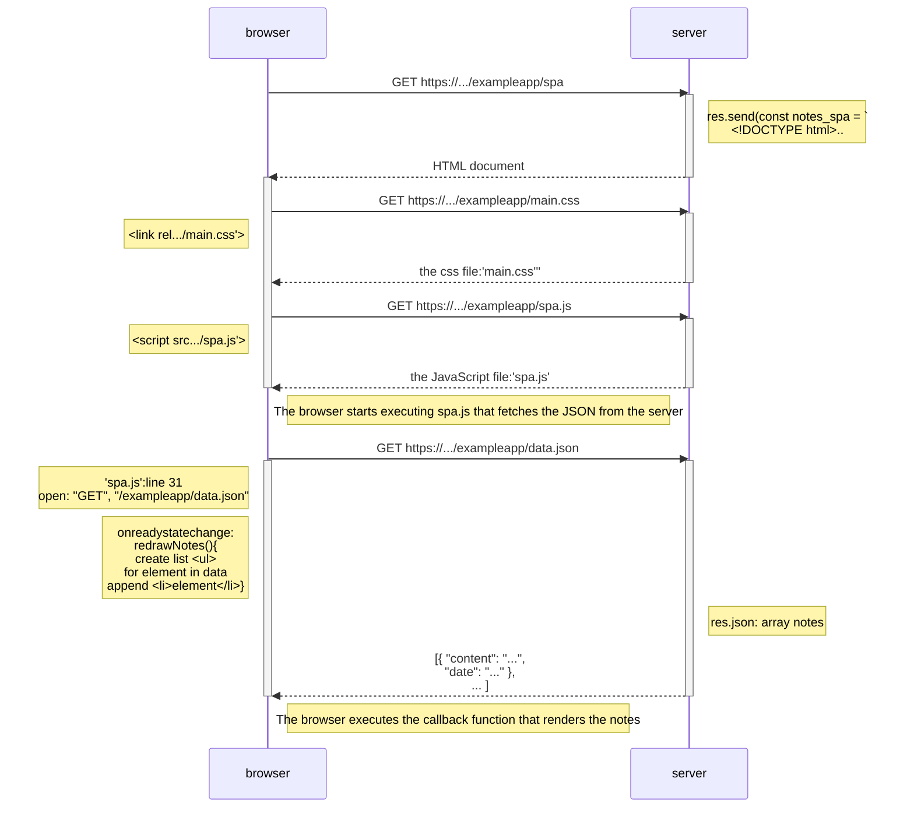

 

# Exercice 0.5 
## Single page application diagram
### Author: Enrique Anton Lopez
### Date: 2024/06/13

```mermaid   
    sequenceDiagram 
    participant browser
    participant server

    browser->>server: GET https://.../exampleapp/spa
    activate server
    
    Note right of server: res.send(const notes_spa = `<br><!DOCTYPE html>.. 
    server-->>browser: HTML document 
    deactivate server

   
    activate browser
    browser->>server: GET https://.../exampleapp/main.css
    activate server
    Note left of browser:<link rel.../main.css'>
    server-->>browser: the css file:'main.css'''
    deactivate server

    browser->>server: GET https://.../exampleapp/spa.js
    activate server
    Note left of browser:<script src.../spa.js'>
    server-->>browser: the JavaScript file:'spa.js'     
    deactivate server
    deactivate browser

    
    Note right of browser: The browser starts executing spa.js that fetches the JSON from the server
    browser->>server: GET https://.../exampleapp/data.json
    activate browser
    activate server
    Note left of browser: 'spa.js':line 31<br> open: "GET", "/exampleapp/data.json"
    Note left of browser: onreadystatechange: <br>redrawNotes(){<br>create list <ul><br>for element in data <br>append <li>element</li>}
    Note right of server: res.json: array notes
    
    
    server-->>browser: [{ "content": "...", <br>"date": "..." },<br> ... ]
    deactivate server
    deactivate browser
    Note right of browser: The browser executes the callback function that renders the notes

```